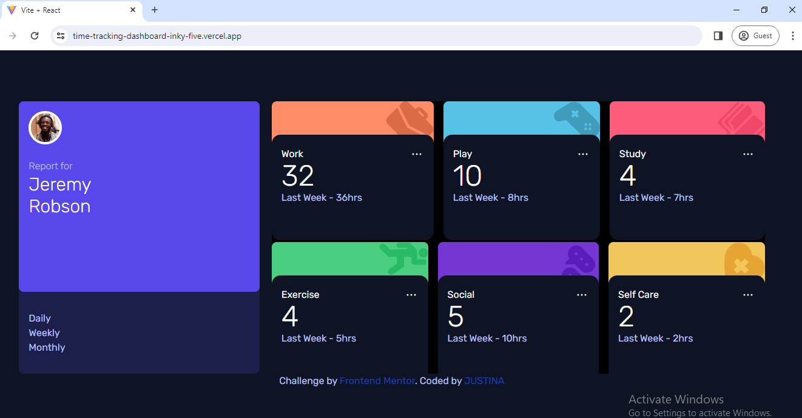

# Frontend Mentor - Time tracking dashboard solution

This is a solution to the [Time tracking dashboard challenge on Frontend Mentor](https://www.frontendmentor.io/challenges/time-tracking-dashboard-UIQ7167Jw). Frontend Mentor challenges help you improve your coding skills by building realistic projects.

## Table of contents

- [Overview](#overview)
  - [The challenge](#the-challenge)
  - [Screenshot](#screenshot)
  - [Links](#links)
- [My process](#my-process)
  - [Built with](#built-with)
  - [What I learned](#what-i-learned)
  - [LOCAL USE](#LOCAL)
  - [Useful resources](#useful-resources)
- [Author](#author)

## Overview

### The challenge

Users should be able to:

- View the optimal layout for the site depending on their device's screen size
- See hover states for all interactive elements on the page
- Switch between viewing Daily, Weekly, and Monthly stats

### Screenshot

Below are screenshots of completed website


.png)

.png)


### Links

- Live Site URL: [TIME-TRACKING-DASHBORAD](https://time-tracking-dashboard-inky-five.vercel.app/)

## My process

During the development process I took out time to go through the design and imagine the workflow before implementation.

1. I created my react project
2. I added my folder structure
3. Installed packages
4. Create a Repository
5. Implementation
6. Push to github
7. Edit Readme file
8. Host Project

### Built with

- Flexbox
- CSS Grid
- [React](https://reactjs.org/) - JS library
- [TailwindCss](https://tailwindcss.com/) - CSS Framework
- [classes](https://www.npmjs.com/package/classnames)- Npm Package for conditionally adding classes

### What I learned

1. I learnt about the npm classenamenpm package

- It helps make your code more organized in terms of conditionally adding classes, this package handles it in a clear and precise way.

```jsx
<div
  className={classNames(
    "background-wrapper bg-no-repeat bg-right-top",
    { " bg-Work bg-brand-work": title === "Work" },
    { "bg-Play bg-brand-play": title === "Play" },
    {
      "bg-brand-study bg-Study": title === "Study",
    },
    {
      "bg-Exercise bg-brand-exercise": title === "Exercise",
    },
    {
      "bg-Social bg-brand-social": title === "Social",
    },
    {
      "bg-Self-Care bg-brand-selfCare": title === "Self Care",
    }
  )}
></div>
```

### LOCAL USE

If you want to run this project locally, follow the steps below:

1. Fork Repo

2. Open Project with any IDE of your choice

3. Open your terminal

3. RUN: npm install

4. RUN: npm run dev

5. VISIT THE URL DISPLAYED ON YOUR TERMINAL

🎉🎉 YOU HAVE A PROJECT RUNNING LOCALLY !!!

### Useful resources

- [ classname npm package](https://www.npmjs.com/package/classnames) - This helped me add conditonal classes to my project in a clearner manner.

## Author

- Website - [JUSTINA](https://github.com/NICKY-TECH)
